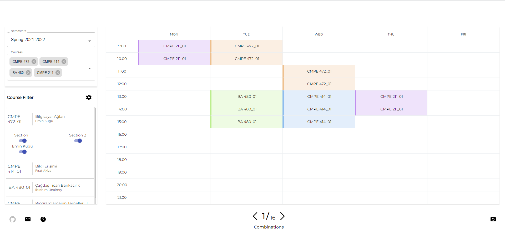
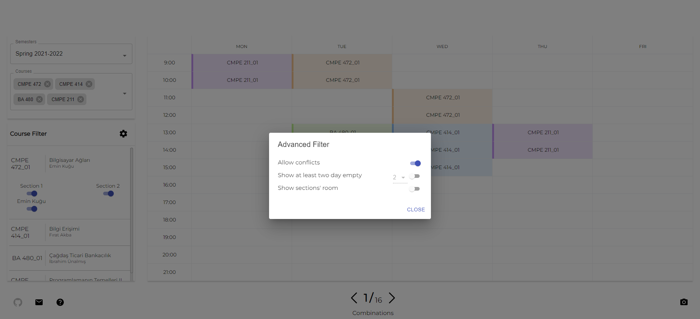
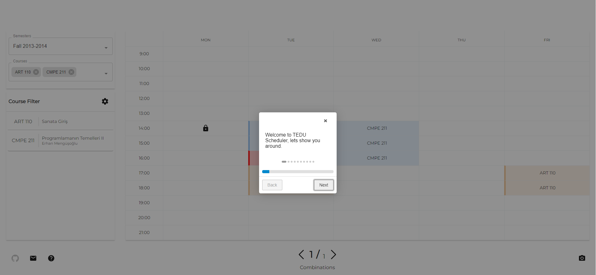

    <h3>This project originally belongs to <a href="https://github.com/berkayozek/">@berkayozek</a> and this fork implements several new features onto the project.</h3>

    <h1>TEDU Scheduler</h1>
    
     
    <a href="https://emreoyun.tk/apps/teduscheduler">Scheduler Link</a>

A scheduler application that generates possible schedules for TED University students.
Spring-boot is used in back-end and React.JS is used in front-end. 
For the storing data, PostgresSQL is used. 
For the deployment of the project, Docker is used. 
Both Frontend and Backend side has Dockerfile for building the project with Docker.
Nginx is used for forwarding port to url and handles SSL certificate.

# Technologies
- Springboot
- React.JS
- PostgresSQL
- Docker
- Nginx

# Features
- Generating possible timetable from selected courses.
- Filtering selected courses by course's section and lecturers.
- Advanced Course filter can be used for filtering the timetable.
- Downloading image of the timetable.
- Fetching the Course data from TED University Course-Offered website. (See Constraints)
- Tutorial for understanding the UX.

# Screenshots

# Constraints
After TED University changed their website, it is not possible the fetch all course data for new semesters. If they fix Course-Offered page, fetching data feature will be working. 

# Build
Before building the project, BACKEND_URL which is located in `/frontend/src/config/index.js` needs to be changed and PostgresSQL configuration needs to be changed from application.properties.

### Frontend
`sudo docker build -t tedu-scheduler-frontend  .`

### Backend
`$ sudo docker build --network="host" -t tedu-scheduler-backend  .`

# Deploying on Docker
### Frontend
`$ sudo docker run -d -p 0.0.0.0:5000:5000 tedu-scheduler-frontend`

### Backend
After the building we need to move compiled jar file into corresponding folder.
 
`$ mv ./target/teduscheduler-0.0.1-SNAPSHOT.jar ./teduscheduler-0.0.1-SNAPSHOT.jar`
 
`$ sudo docker run -d --network="host" -p 0.0.0.0:8081:8081 tedu-scheduler-backend`
